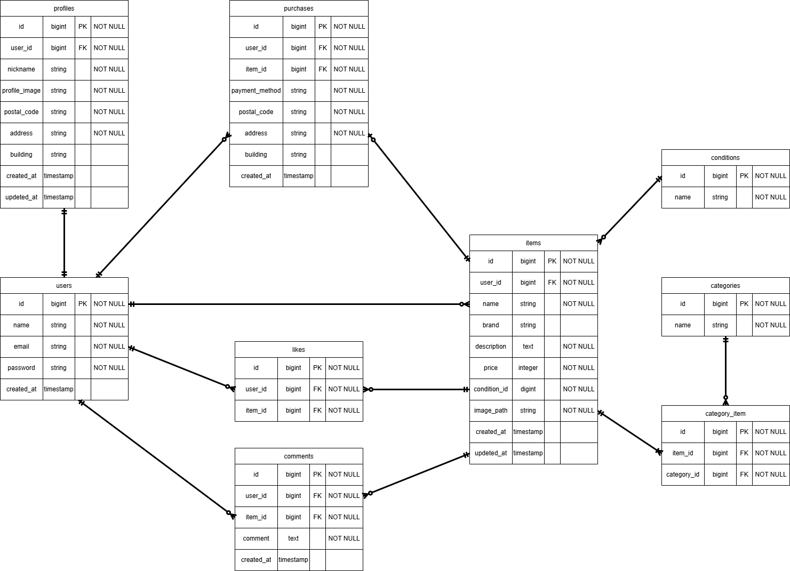

# Flea Market Application

## 概要

ユーザーが商品を出品・購入できるフリマアプリです。
会員登録・ログイン・商品出品・購入・いいね機能などを実装しています。


## 使用技術

* **バックエンド**: PHP / Laravel
* **フロントエンド**: Blade / CSS
* **データベース**: MySQL
* **環境**: Docker / Docker Compose / WSL2
* **認証**: Laravel Fortify
* **その他**:

  * Storage（画像アップロード）
  * バリデーション（FormRequest）

---

## 機能一覧

### 認証機能

* 会員登録
* ログイン / ログアウト
* メール認証

### 商品機能

* 商品一覧表示
* 商品詳細表示
* 商品出品
* 商品検索

### 購入機能

* 商品購入
* 購入済み商品の「Sold」表示
* 支払い方法選択

### プロフィール機能

* プロフィール編集
* 住所登録 / 変更
* 出品商品一覧
* 購入商品一覧

### その他

* いいね機能（追加 / 解除）
* コメント機能

---

## ER図




---

## 環境構築

### 1. リポジトリをクローン

```bash
git clone https://github.com/izumiyuki214/Flea-Market.git
cd Flea-Market
```

---

### 2. Docker起動

```bash
docker compose up -d --build
```

---

### 3. Laravelセットアップ

```bash
docker compose exec php composer install
cp src/.env.example src/.env
docker compose exec php php artisan key:generate
```

---

### 4. マイグレーション & シーディング

```bash
docker compose exec php php artisan migrate --seed
```

---

### 5. ストレージリンク作成

```bash
docker compose exec php php artisan storage:link
```

---

### 6. アクセス

```
http://localhost
```


## テスト

```bash
docker compose exec php php artisan test
```
